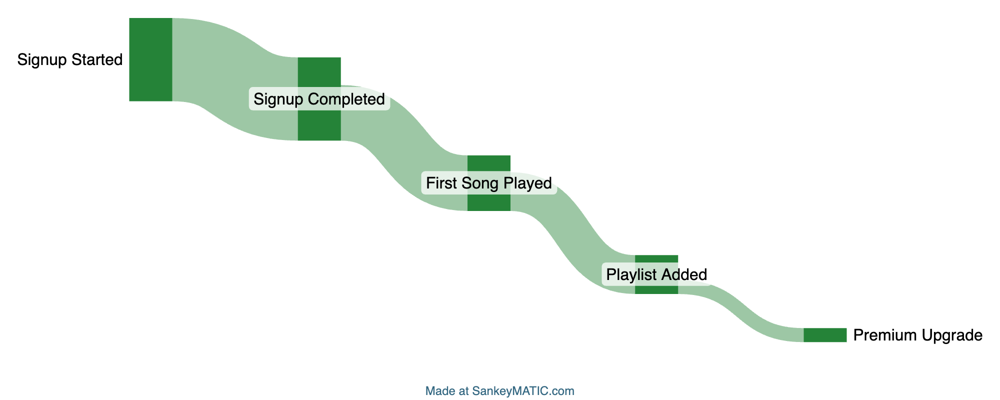
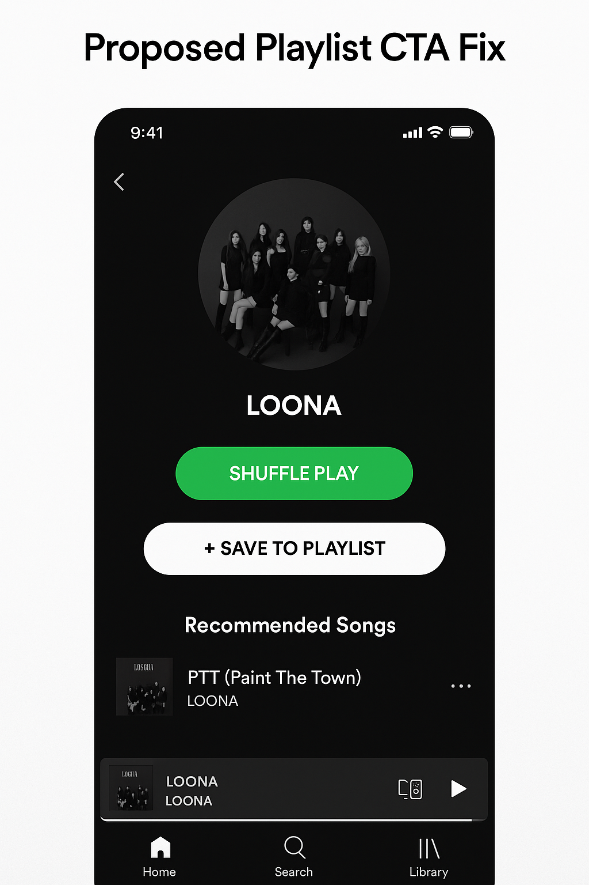

# Spotify Funnel Analysis (SQL + Product Analytics)

**Problem:** 64% of users drop off after playing their first song without saving it to a playlist.  

**Analysis:**  
- Funnels show the biggest leak = *First Play → Playlist*  
- Playlist creators retain **2x better** than non-creators  
- Mobile & referral users have the weakest retention  

**Recommendation:** Make the playlist CTA more visible and nudge users after their first play.  

**Impact:** Increasing playlist creation could lift retention and downstream Premium upgrades.

## Funnel Leak

## Proposed Playlist CTA Fix

Current design buries playlist under menus.  
👉 Proposed: A more visible CTA right after first play.

